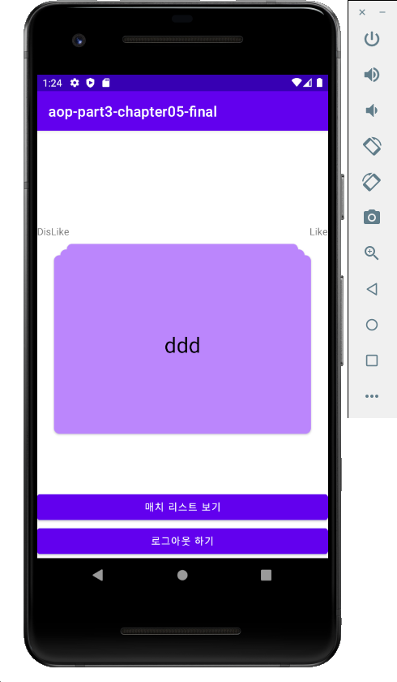

# Tinder

## 이 챕터를 통해 배운 것

- **Firebase Authenetication** 사용하기

  - Email Login
  - Facebook Login

- **Firebase Realtime Database** 사용하기

- yuyakaido/CardStackView 사용하기

## 결과화면

### 틴더

Firebase Authentication 을 통해 이메일 로그인과 페이스북 로그인을 할 수 있음.

Firebase Realtime Database 를 이용하여 기록을 저장하고, 불러올 수 있음.

Github에서 Opensource Library 를 찾아 사용할 수 있음.

